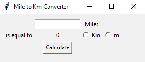
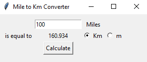

# Miles to km converter
> The app converts miles to km or m.
> 

## Table of Contents
* [General Information](#general-information)
* [Technologies Used](#technologies-used)
* [Features](#features)
* [Screenshots](#screenshots)
* [Project Status](#project-status)

## General Information
- After providing a value into the blank space and clicking on the calculate button, program shows converted value in km/m

## Technologies Used
- Python 3.12

## Features
List the ready features here:
- Converting function
- Tracking the wanted unit

## Screenshots

## Project Status
Project is: _complete_ 
